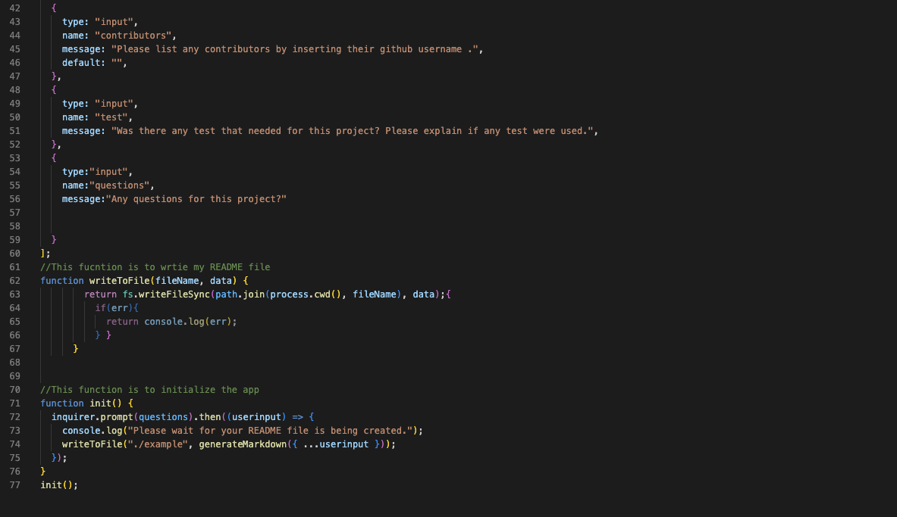

# Professional README Generator 

## Description
This program will allow you to use to generate professiona README by answering few questions that will be incldued in your README. 
The questions are set up in a array and each of the questions that is being asked will be stored in a object. 

## Installation
You need to start by installing "npm init". Once a folder name called "node_modules" you could use the terminal to operate the program by using node index. 

## Test
You could look at the folder name example to see the README that was created by using this program

## Credits
Node.js, inquirer

